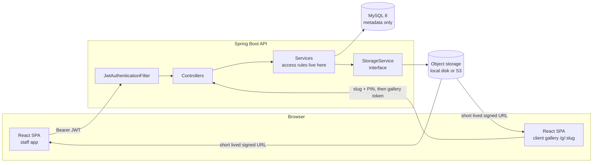
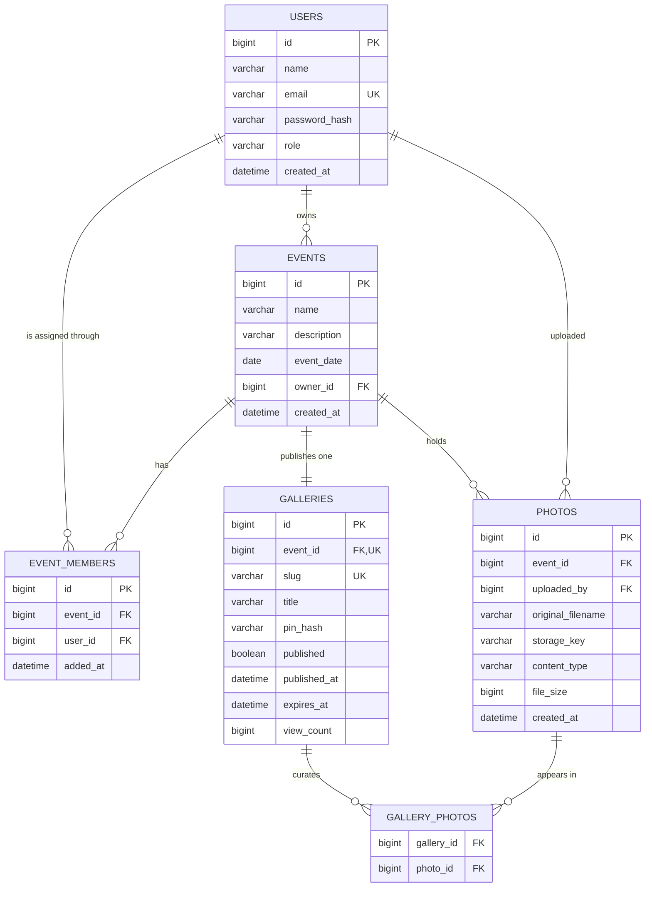

# Frame — event photo sharing platform

A full-stack application for a photography team: photographers upload event
photos, the studio lead curates the selects, and the client opens a PIN
protected gallery through a shareable link without creating an account.


---

## Contents

- [What it does](#what-it-does)
- [Tech stack](#tech-stack)
- [Architecture](#architecture)
- [Database design](#database-design)
- [Running it locally](#running-it-locally)
- [Environment variables](#environment-variables)
- [Demo credentials](#demo-credentials)
- [API reference](#api-reference)
- [Security notes](#security-notes)
- [Tests](#tests)
- [Deployment](#deployment)
- [Known limitations](#known-limitations)

---

## What it does

| Step | Actor | What happens |
|------|-------|--------------|
| 1 | Admin / Lead | Creates an event and adds team members |
| 2 | Team Member | Uploads event photos |
| 3 | Admin | Reviews every upload and marks the ones the client should see |
| 4 | Admin | Publishes the gallery, which generates a link and a PIN |
| 5 | Customer | Opens the link, enters the PIN, browses the photographs |

**Admin / Lead** registers, creates events, adds team members, sees every photo
on their events, marks the selects, publishes and unpublishes the gallery, sets
or regenerates the PIN, and can set an expiry date.

**Team Member** is created by an admin, signs in, sees only the events they were
assigned to, uploads photos, and sees only their own uploads. They cannot
publish a gallery or touch anyone else's photos.

**Customer** has no account. A link plus a PIN gets them a short lived token
that opens the gallery and nothing else.

---

## Tech stack

| Layer | Choice | Why |
|-------|--------|-----|
| Frontend | React 18 + Vite, React Router, Axios | Fast dev loop, no framework weight the brief does not need |
| Backend | Java 17, Spring Boot 3.2, Spring Security, Spring Data JPA | Strong typing and mature auth primitives for a role-heavy domain |
| Database | MySQL 8 | Relational data with clear foreign keys: users, events, photos, galleries |
| Auth | Stateless JWT (jjwt) | Two token types, no server-side session to replicate |
| Storage | Pluggable: local disk by default, AWS S3 by config | The DB stores metadata only, never image bytes |
| Packaging | Docker + docker compose | One command brings up database, API and web |

No styling framework: the CSS is hand-written so the contact-sheet grid and the
client gallery can look like two deliberately different rooms.

---

## Architecture



### How a request flows

1. `JwtAuthenticationFilter` reads the `Authorization: Bearer` header, verifies
   the signature, checks the token is an **access** token (not a gallery token),
   and puts an `AppUserPrincipal` in the security context.
2. Controllers stay thin: validate the request body and delegate.
3. Services own every access decision. `EventService.requireReadAccess` and
   `requireManageAccess` are the two gates every event-scoped operation passes
   through, so the rule lives in one place rather than being repeated per endpoint.
4. Photo binaries never pass through a JSON response. The API returns a **signed
   URL** with an expiry, and the browser loads the image directly.

### The storage abstraction

`StorageService` has two implementations selected by `app.storage.type`:

- `LocalStorageService` writes to disk and signs URLs itself with HMAC-SHA256
  over `(key, expiry)`. `FileController` re-verifies the signature in constant
  time before streaming the file, so a guessed key is useless.
- `S3StorageService` uploads to a bucket and hands back a genuine S3 presigned
  URL, so image traffic never touches the application server. When S3 is
  enabled, `FileController` is not even registered.

Swapping between them is one environment variable. That is the whole point of
the interface.

### Why the two token types

A customer who unlocks a gallery gets a JWT whose subject is the gallery **slug**
and whose type claim is `gallery`. The staff filter only accepts tokens with type
`access`, and `viewWithToken` only accepts a `gallery` token whose subject matches
the slug being requested. So a gallery token cannot be replayed against the staff
API, and a token for gallery A cannot open gallery B. There is a test for each.

---

## Database design



Decisions worth calling out:

- **`event_members` is its own table**, not a role column. A user can be a
  photographer on three events and unrelated to a fourth, and the relationship
  carries its own timestamp.
- **`photos.storage_key` points at object storage.** No BLOBs. Metadata rows stay
  small, the database stays fast, and the files can move to S3 without a data migration.
- **`gallery_photos` is the selection.** Selecting is a join-table write, not a
  copy of the file, so a photo can be unselected without touching storage.
- **`galleries.pin_hash` is BCrypt.** The plain PIN exists for exactly one
  response, at publish time, and is never recoverable afterwards.
- Indexes on `photos.event_id`, `photos.uploaded_by` and `events.owner_id` cover
  the three queries the UI actually makes.

The exact DDL Hibernate generates is checked in at [`docs/schema.sql`](docs/schema.sql).

---

## Running it locally

### Option A — Docker (nothing to install but Docker)

```bash
git clone <repo-url> && cd photoshare
docker compose up --build
```

- Web app: http://localhost:5173
- API: http://localhost:8080
- MySQL: localhost:3306

### Option B — run the parts yourself

**Prerequisites:** JDK 17+, Node 18+, MySQL 8.

```bash
# 1. Database
mysql -u root -p -e "CREATE DATABASE photoshare CHARACTER SET utf8mb4;"
mysql -u root -p -e "CREATE USER 'photoshare'@'%' IDENTIFIED BY 'photoshare';"
mysql -u root -p -e "GRANT ALL ON photoshare.* TO 'photoshare'@'%'; FLUSH PRIVILEGES;"

# 2. Backend  (http://localhost:8080)
cd backend
mvn spring-boot:run

# 3. Frontend (http://localhost:5173)
cd ../frontend
cp .env.example .env
npm install
npm run dev
```

Schema tables are created automatically on first start, and demo data is seeded
into an empty database.

---

## Environment variables

Everything is configurable; nothing sensitive is committed. See `.env.example`.

| Variable | Default | Notes |
|----------|---------|-------|
| `DB_URL` | `jdbc:mysql://localhost:3306/photoshare` | JDBC URL |
| `DB_USERNAME` / `DB_PASSWORD` | `photoshare` | Database credentials |
| `JWT_SECRET` | dev placeholder | **Set this in production.** 32+ characters; the app refuses to start on anything shorter |
| `JWT_ACCESS_MINUTES` | `720` | Staff token lifetime |
| `JWT_GALLERY_MINUTES` | `120` | Customer gallery token lifetime |
| `PUBLIC_BASE_URL` | `http://localhost:8080` | Used to build signed file URLs |
| `FRONTEND_BASE_URL` | `http://localhost:5173` | Used to build the share link |
| `CORS_ALLOWED_ORIGINS` | `http://localhost:5173` | Comma separated |
| `STORAGE_TYPE` | `local` | `local` or `s3` |
| `STORAGE_LOCAL_DIR` | `./data/uploads` | Where local files go |
| `S3_BUCKET` / `AWS_REGION` / `S3_ENDPOINT` | — | Required when `STORAGE_TYPE=s3` |
| `SIGNED_URL_MINUTES` | `30` | Photo URL lifetime |
| `DEMO_SEED` | `true` | Seeds demo accounts on an empty database |

---

## Demo credentials

| Role | Email | Password |
|------|-------|----------|
| Admin / Lead | `admin@trizen-ai.com` | `Admin@12345` |
| Team Member | `photographer@trizen-ai.com` | `Member@12345` |

A demo event, "Arjun & Priya Wedding", is seeded with the photographer already
assigned. To see the customer flow end to end: sign in as the admin, upload a few
photos, open **Client gallery**, mark some frames, publish, then open the link in
a private window and enter the PIN.

> The gallery link and PIN in the submission email were generated from the
> deployed instance; regenerate them any time by publishing again.

---

## API reference

All staff endpoints expect `Authorization: Bearer <token>`.
Full request and response shapes are in [`docs/API.md`](docs/API.md).

### Auth
| Method | Path | Who |
|--------|------|-----|
| `POST` | `/api/auth/register` | Anyone — creates an admin |
| `POST` | `/api/auth/login` | Anyone |
| `GET` | `/api/auth/me` | Signed in |

### Events and team
| Method | Path | Who |
|--------|------|-----|
| `GET` | `/api/events` | Signed in — owned plus assigned |
| `POST` | `/api/events` | Admin |
| `GET` | `/api/events/{id}` | Owner or assigned member |
| `GET` | `/api/events/{id}/members` | Owner or assigned member |
| `POST` | `/api/events/{id}/members` | Owning admin |
| `DELETE` | `/api/events/{id}/members/{userId}` | Owning admin |

### Photos
| Method | Path | Who |
|--------|------|-----|
| `GET` | `/api/events/{id}/photos?page=&size=` | Admin sees all, member sees own |
| `POST` | `/api/events/{id}/photos` | Owner or assigned member, `multipart/form-data`, field `files` |
| `DELETE` | `/api/photos/{photoId}` | Uploader or owning admin |

### Gallery (admin)
| Method | Path |
|--------|------|
| `GET` | `/api/events/{id}/gallery` |
| `PUT` | `/api/events/{id}/gallery/selection` |
| `POST` | `/api/events/{id}/gallery/publish` |
| `POST` | `/api/events/{id}/gallery/unpublish` |

### Gallery (customer, no account)
| Method | Path |
|--------|------|
| `GET` | `/api/public/galleries/{slug}` — title only, for the unlock screen |
| `POST` | `/api/public/galleries/{slug}/access` — `{ "pin": "482917" }` returns a gallery token |
| `GET` | `/api/public/galleries/{slug}/photos` — requires `X-Gallery-Token` |

Every error uses the same shape:

```json
{
  "timestamp": "2026-09-16T10:12:04Z",
  "status": 400,
  "error": "Bad Request",
  "message": "Some fields need attention",
  "path": "/api/auth/register",
  "fieldErrors": { "password": "size must be between 8 and 72" }
}
```

---

## Security notes

- **Passwords and PINs are BCrypt hashed.** Neither is recoverable, and the PIN is
  returned in exactly one response.
- **Role and ownership are checked server side on every request.** The frontend
  hides the publish tab from a team member; the backend refuses the call anyway.
- **Unknown events return 404, not 403**, so ids cannot be probed to learn which
  events exist.
- **PIN guessing is throttled**: five wrong attempts from one caller lock that
  gallery for fifteen minutes.
- **Photo URLs expire.** Thirty minutes by default, signed, and verified with a
  constant-time comparison.
- **Uploads are validated** on content type, size and count before anything is
  written, and are stored under a random UUID key so the original filename can
  never influence the path.
- **Path traversal is blocked**: a resolved file must stay inside the storage root.
- **CORS is an allow-list**, not a wildcard.
- **Secrets come from the environment.** Nothing sensitive is in the repository,
  and the app refuses to boot with a JWT secret shorter than 32 characters.

The scenarios the brief asks about, and what happens:

| Scenario | Result |
|----------|--------|
| A user reaching another event | `404 Not Found` |
| A team member publishing a gallery | `403 Forbidden` |
| A failed photo upload | `200` with the file listed under `failed`; the rest of the batch still lands |
| An incorrect gallery PIN | `403` with attempts remaining, then `429` after five |
| Access to unpublished photos | `404` for the gallery, `403` without a valid gallery token |

---

## Tests

```bash
cd backend
mvn test
```

Three suites run against an in-memory H2 database through the real HTTP layer:

- `AuthApiTest` — registration, duplicate email, weak password, wrong password,
  missing token, tampered token.
- `EventAccessControlTest` — cross-event access, team member publish attempt, a
  member seeing only their own uploads, a bad file in a good batch, uploading to
  an event you are not on.
- `GalleryPublishingTest` — publish generates a slug and PIN, empty selection is
  refused, right and wrong PIN, photos locked without a token, a token scoped to
  its own gallery, unpublish hides the gallery, brute force is throttled.

---

## Deployment

The application is deployed and reachable online; the live URL and demo
credentials are in the submission email.

**Shape of the deployment**

- Frontend: static build served by any CDN or static host (Netlify, Vercel,
  S3 + CloudFront, or the bundled Nginx image). SPA rewrites are configured in
  `nginx.conf`, `public/_redirects` and `vercel.json`.
- Backend: the Docker image from `backend/Dockerfile` on any container host
  (Railway, Render, Fly.io, ECS). Health check on `/actuator/health`.
- Database: a managed MySQL 8 instance.
- Storage: `STORAGE_TYPE=s3` with a private bucket, the container's IAM role
  granting `s3:PutObject` and `s3:GetObject` on that bucket only.

**Checklist before going live**

```bash
JWT_SECRET=$(openssl rand -base64 48)   # never the default
DEMO_SEED=false                          # after creating your real accounts
CORS_ALLOWED_ORIGINS=https://your-frontend-domain
PUBLIC_BASE_URL=https://your-api-domain
FRONTEND_BASE_URL=https://your-frontend-domain
STORAGE_TYPE=s3
```

Serve both over HTTPS. The JWT lives in `localStorage`, which is fine over TLS
for this scope; moving it to an httpOnly cookie is the next hardening step and
is listed below.

---

## Known limitations

Honest list of what I would do next, roughly in priority order.

1. **No image thumbnails.** The contact sheet loads full size images scaled down
   by CSS. The fix is generating a 400px derivative on upload (Thumbnailator, or
   a Lambda on S3 `ObjectCreated`) and serving that in grids.
2. **PIN throttling is in-memory**, so it resets on restart and is per node.
   Redis-backed counters would survive both.
3. **Token in `localStorage`.** Rotating refresh tokens in httpOnly cookies would
   remove the XSS exposure.
4. **`ddl-auto: update`.** Right for an exercise, wrong for a team. Flyway
   migrations are the next commit; `docs/schema.sql` is already the starting point.
5. **Uploads are synchronous.** A 600-photo drop holds the request open. Presigned
   direct-to-S3 uploads from the browser would take the application server out of
   the data path entirely.
6. **Content type is trusted from the client.** Magic-byte sniffing would catch a
   renamed file.
7. **No soft delete or audit trail.** Deleting a photo removes the row and the
   object; a studio would want a recycle bin.
8. **Gallery expiry is checked on read**, not swept. A scheduled job should clear
   expired galleries and their derivatives.
9. **No download-all.** A zip-on-demand endpoint is the obvious client request.
10. **Frontend has no component tests.** The backend covers the rules that matter,
    but React Testing Library coverage of the unlock flow would be worth adding.
